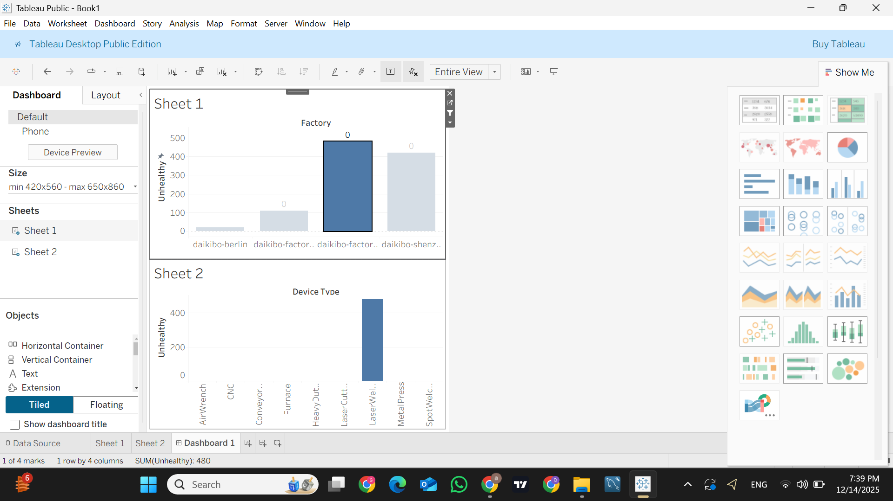

# Deloitte Data Analytics Job Simulation (Forage)

This repository contains my work and certification from the
**Deloitte Data Analytics Job Simulation** completed on **Forage**.

## About the Program
The Deloitte Data Analytics Job Simulation provides hands-on
experience with real-world business problems, focusing on data
analysis, interpretation, and visualization.

## Skills Gained
- Data Analysis
- Business Problem Solving
- Data Visualization
- Analytical Thinking

## Certificate
📄 **Deloitte Data Analytics Job Simulation – Certificate**  
[Click here to view the certificate](./data-analyst-deloitte-certificate.pdf)

 

## Tableau Project – Machine Breakdown Analysis

This project analyzes machine telemetry data to identify:
- The factory location with the highest machine downtime
- The machine types contributing most to breakdowns

### Tools Used
- Tableau Public
- JSON Telemetry Data

### Dashboard Preview

## Candidate
**Name:** Appaso Suryavanshi  
**Completion Date:** December 2025 
---

*This repository is part of my learning and professional portfolio.*
